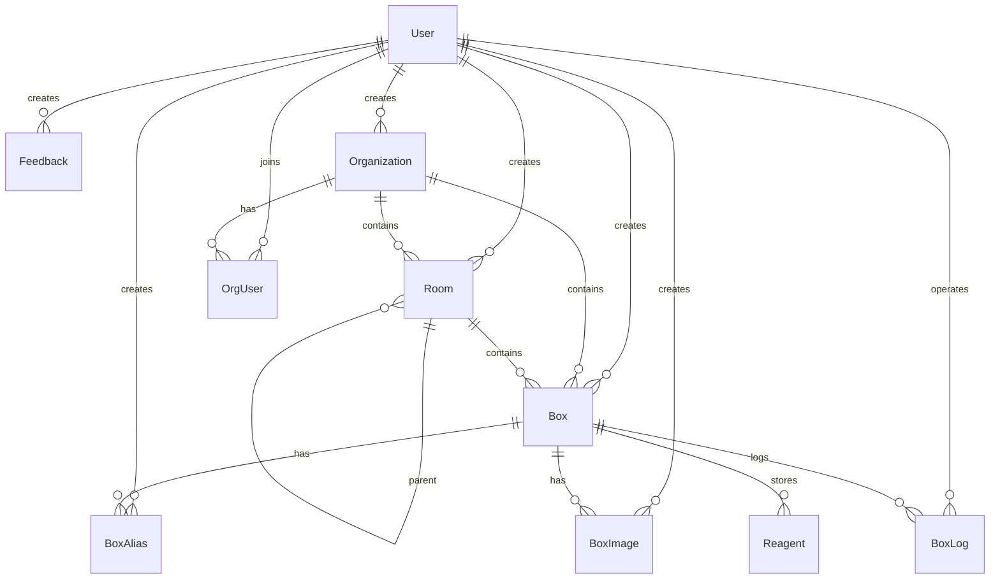
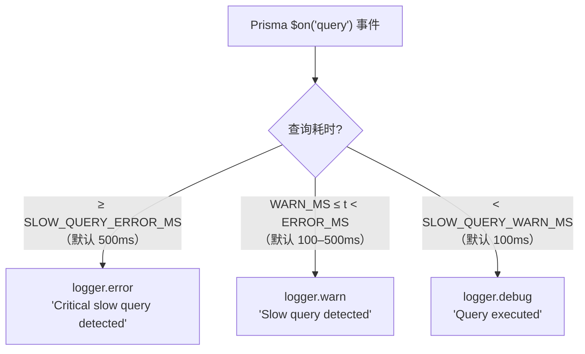

# 数据库层

`DatabaseService`（`src/infra/database/`）基于 Prisma 7 + PG Adapter，封装 PostgreSQL 连接管理、查询监控与参数脱敏。当前包含 10 个数据模型。

---

## 1. 架构关系

```
DatabaseService (extends PrismaClient)
  ├─ @prisma/adapter-pg  ←→  pg.Pool（连接池）  ←→  PostgreSQL
  └─ $on('query')         →  handleQueryEvent()  →  PinoLogger（含脱敏）
```

Prisma 通过原生 PG Adapter 替代 Prisma 自带的连接管理器，直接使用 `pg.Pool` 控制连接生命周期。

---

## 2. 连接池配置

| 参数 | 值 | 说明 |
|------|-----|------|
| `max` | 12 | 最大并发连接数 |
| `min` | 2 | 最小保持连接数 |
| `idleTimeoutMillis` | 30000ms | 空闲连接 30s 后断开 |
| `connectionTimeoutMillis` | 2000ms | 连接建立超时 2s |

> 连接池参数当前在 `DatabaseService` 初始化时硬编码，修改时同步更新此文档。

---

## 3. 数据模型

### 模型关系总览



### User

| 字段 | 类型 | 约束 | 说明 |
|------|------|------|------|
| `id` | `String` | `@id @default(ulid())` | ULID 主键 |
| `username` | `String` | `@unique` | 账号（唯一） |
| `email` | `String` | `@unique` | 邮箱（唯一） |
| `passwordHash` | `String` | — | bcryptjs 10 rounds |
| `nickName` | `String?` | — | 昵称 |
| `realName` | `String?` | — | 真实姓名 |
| `uid` | `String` | `@unique @default(ulid())` | 用户公开标识（用于邀请等场景） |
| `createdAt` | `DateTime` | `@default(now())` | 创建时间 |
| `updatedAt` | `DateTime` | `@updatedAt` | 自动维护 |

索引：`@@index([createdAt])`

### Feedback

| 字段 | 类型 | 约束 | 说明 |
|------|------|------|------|
| `id` | `String` | `@id @default(ulid())` | ULID 主键 |
| `content` | `String?` | — | 反馈内容 |
| `email` | `String?` | — | 联系邮箱 |
| `imageList` | `String?` | — | 图片列表（JSON 字符串） |
| `progress` | `Int` | `@default(0)` | 处理进度 |
| `type` | `Int` | `@default(0)` | 反馈类型 |
| `createBy` | `String?` | FK → User | 创建者 |
| `finishTime` | `DateTime?` | — | 完成时间 |

### Room

| 字段 | 类型 | 约束 | 说明 |
|------|------|------|------|
| `id` | `String` | `@id @default(ulid())` | ULID 主键 |
| `roomName` | `String?` | — | 房间名称 |
| `roomDescribe` | `String?` | — | 房间描述 |
| `parentId` | `String?` | FK → Room（自引用） | 父房间 ID |
| `isDelete` | `Int` | `@default(0)` | 软删除标记 |
| `createBy` | `String?` | FK → User | 创建者 |
| `orgId` | `String` | FK → Organization | 所属组织 |

索引：`@@index([orgId])`

### Box

| 字段 | 类型 | 约束 | 说明 |
|------|------|------|------|
| `id` | `String` | `@id @default(ulid())` | ULID 主键 |
| `name` | `String?` | — | 盒子名称 |
| `shortName` | `String?` | — | 简称 |
| `introduce` | `String?` | — | 描述 |
| `authorityLevel` | `Int` | `@default(0)` | 权限级别 |
| `way` | `Int` | `@default(0)` | 存储方式 |
| `x` / `y` | `Int` | `@default(0)` | 网格尺寸 |
| `isDelete` | `Int` | `@default(0)` | 软删除标记 |
| `rootId` | `String?` | FK → Room | 所在房间 |
| `createBy` | `String?` | FK → User | 创建者 |
| `orgId` | `String` | FK → Organization | 所属组织 |

索引：`@@index([orgId])`

### BoxAlias

| 字段 | 类型 | 约束 | 说明 |
|------|------|------|------|
| `id` | `String` | `@id @default(ulid())` | ULID 主键 |
| `aliasName` | `String?` | — | 别名 |
| `boxId` | `String` | FK → Box | 所属盒子 |
| `createBy` | `String?` | FK → User | 创建者 |

索引：`@@index([boxId])`

### BoxImage

| 字段 | 类型 | 约束 | 说明 |
|------|------|------|------|
| `id` | `String` | `@id @default(ulid())` | ULID 主键 |
| `url` | `String` | — | 图片链接 |
| `boxId` | `String` | FK → Box | 所属盒子 |
| `orgId` | `String` | — | 所属组织 |
| `createBy` | `String?` | FK → User | 拍照用户 |

索引：`@@index([boxId])`

### BoxLog

| 字段 | 类型 | 约束 | 说明 |
|------|------|------|------|
| `id` | `String` | `@id @default(ulid())` | ULID 主键 |
| `boxId` | `String` | FK → Box | 所属盒子 |
| `orgId` | `String` | — | 所属组织 |
| `action` | `String?` | — | 操作类型 |
| `detail` | `String?` | — | 操作详情 |
| `reagentId` | `String?` | — | 关联试剂 ID |
| `userId` | `String?` | FK → User | 操作用户 |
| `operatorId` | `String?` | FK → User | 操作人（试剂日志） |

索引：`@@index([boxId])`, `@@index([reagentId])`

### Organization

| 字段 | 类型 | 约束 | 说明 |
|------|------|------|------|
| `id` | `String` | `@id @default(ulid())` | ULID 主键 |
| `name` | `String` | — | 组织名称 |
| `introduce` | `String?` | — | 组织介绍 |
| `member` | `Int` | `@default(0)` | 成员数量（冗余计数） |
| `createBy` | `String?` | FK → User | 创建者 |

### OrgUser

| 字段 | 类型 | 约束 | 说明 |
|------|------|------|------|
| `id` | `String` | `@id @default(ulid())` | ULID 主键 |
| `orgId` | `String` | FK → Organization（级联删除） | 所属组织 |
| `userId` | `String` | FK → User | 成员用户 |
| `role` | `Int` | `@default(0)` | 角色（0=成员） |
| `status` | `Int` | `@default(0)` | 状态（申请/邀请/已加入） |
| `message` | `String?` | — | 申请/邀请附言 |
| `inviteType` | `String?` | — | 邀请类型标识 |

唯一约束：`@@unique([orgId, userId])`，索引：`@@index([orgId])`, `@@index([userId])`

### Reagent

| 字段 | 类型 | 约束 | 说明 |
|------|------|------|------|
| `id` | `String` | `@id @default(ulid())` | ULID 主键 |
| `name` | `String?` | — | 试剂名称 |
| `remark` | `String?` | — | 备注 |
| `x` / `y` | `Int` | `@default(0)` | 在盒子中的坐标 |
| `boxId` | `String` | FK → Box | 所属盒子 |

索引：`@@index([boxId])`

**ULID 选择理由**：26 位字母数字编码，前 10 位为时间戳，时间有序（有利于 B-Tree 索引性能），分布式友好，不依赖数据库序列。UUID v4 完全随机，索引碎片化严重。

---

## 4. 慢查询监控

`DatabaseService` 订阅 Prisma 的 `query` 事件，自动记录耗时并分级告警：



阈值由 `src/constants/observability.constant.ts` 中的 `SLOW_QUERY_THRESHOLDS` 定义，可通过以下环境变量覆盖：

| 环境变量 | 默认值 | 说明 |
|---------|--------|------|
| `SLOW_QUERY_WARN_MS` | `100` | warn 级别阈值（ms）|
| `SLOW_QUERY_ERROR_MS` | `500` | error 级别阈值（ms）|

---

## 5. 参数脱敏规则

日志记录 SQL 参数时，按以下规则脱敏，防止敏感数据写入日志系统：

| 条件 | 处理方式 |
|------|---------|
| 参数值（字符串）含 `password` / `token` / `secret` | 替换为 `[REDACTED]` |
| 参数值长度 > 100 字符 | 截断至 100 字符并追加 `...` |
| 其他 | 原样记录 |

---

## 6. Prisma 错误映射

`AllExceptionsFilter` 将常见 Prisma 错误转换为语义化 HTTP 响应：

| Prisma 错误码 | HTTP 状态 | 错误码 |
|-------------|----------|--------|
| `P2002`（唯一约束冲突）| 409 | `UNIQUE_CONSTRAINT_VIOLATION` |
| `P2003`（外键约束违反）| 400 | `FOREIGN_KEY_VIOLATION` |
| `P2025`（记录不存在）| 404 | `RECORD_NOT_FOUND` |

---

## 7. 服务生命周期

| 生命周期钩子 | 操作 |
|------------|------|
| `OnModuleInit` | `$connect()` + 注册 `query` / `error` / `warn` 事件监听器 |
| `OnModuleDestroy` | `$disconnect()` + 记录断开日志 |

---

## 8. Prisma Client 生成配置

```prisma
generator client {
  provider     = "prisma-client"
  output       = "./generated"      // 输出到 prisma/generated/
  moduleFormat = "cjs"              // CommonJS 格式
}
```

生成产物位于 `prisma/generated/`，由 `pnpm db:gen-client` 触发，**不得手动修改**。

---

## 引用

- [架构设计规范](STANDARD.md)
- [项目架构全览](project-architecture-overview.md)
- [可观测性](observability.md)
